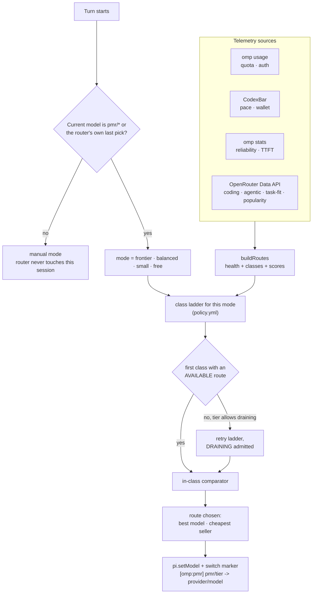
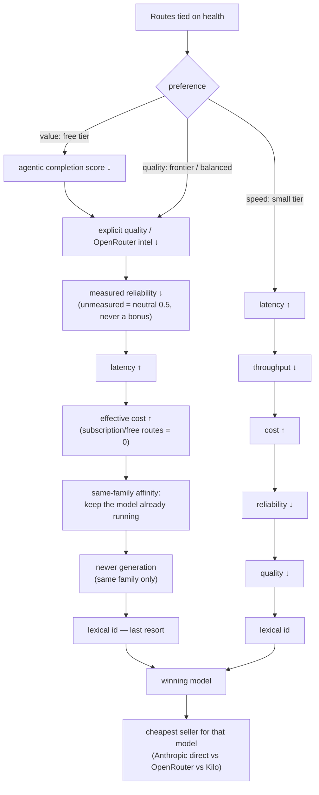

# Poor Man's Router

**Adaptive model routing for [oh-my-pi](https://github.com/nicepkg/oh-my-pi) (`omp`).**
Picks the cheapest model that is *good enough and actually available* for the work in front of it — using the subscriptions you already pay for before spending a cent on pay-as-you-go, and never sending new work to a model whose quota is about to run out.



Inside the comparator, the tie-break order depends on the mode's preference — see [Inside a class](#inside-a-class).

## Opt-in, never automatic

The router registers four **virtual models**. Selecting one is the only way to hand it the wheel:

| Selector | Meaning |
|---|---|
| `pmr/frontier` | managed routing, frontier ladder |
| `pmr/balanced` | managed routing, balanced ladder |
| `pmr/small` | managed routing, small ladder (cheap and fast, paid rungs included) |
| `pmr/free` | managed routing, **free-only** ladder — never spends |

They appear in `/model` and work at cold start (`omp --model pmr/balanced`). Once you pick one, the router switches the session to a concrete model each turn and announces it: `[omp:pmr] pmr/balanced -> kilo/… (reason)`.

**Selecting any real model is an explicit opt-out.** `/model anthropic/claude-sonnet-5` — or starting a session on any concrete model — puts that session in `manual` mode for good: no telemetry polling, no switches, nothing. Return with `/model pmr/balanced`.

Manual mode only silences *this* extension. OMP's own `retry.modelFallback` still handles 429s for the active turn.

For Multica-style spawners, set each agent's model to the tier it needs (`pmr/frontier`, `pmr/balanced`, `pmr/small`, `pmr/free`), or pin it to a concrete model to opt that agent out. No bootstrap mappings.

If a request ever reaches the virtual provider itself — meaning the router failed to switch away — the turn is aborted locally with a loud error instead of retrying against an unroutable endpoint.

## The four ladders

Each mode owns an ordered **class ladder**; the first class with a healthy candidate wins. Lower classes are never consulted while a higher class has a healthy route.

| Mode | Ladder (first match wins) |
|---|---|
| **Frontier** | `fable-sub → astra-sub → opus-sub → opus-ish-sub → strong-flash-sub → strong-chinese → best-free` |
| **Balanced** | `sonnet-sub → luna-sub → chinese-flash-payg → free-chinese-flash → best-available → healthy-free` |
| **Small** | `cheap-sub → cheap-flash → healthy-free-fast` |
| **Free** | `best-free → free-chinese-flash → healthy-free-fast → healthy-free` |

A class is a *semantic* bucket, not a model list: `sonnet-sub` = "any Sonnet reachable through a subscription credential". Models are classified by id pattern (`policy.ts`), then decorated by economics — `-sub` if the provider has a live subscription meter in `omp usage`, `-payg` if it's metered per token, `free` if the selector says so.

The shipped class order is the fallback in [`extension/policy.yml`](extension/policy.yml). When fresh OpenRouter benchmark data is available, `extension/rungs.ts` may derive a sticky order within the same economic boundary; unmeasured classes keep their configured position, and catch-all classes remain tails. `/route-status` reports whether the selected ladder came from policy or the latest snapshot.

## What "healthy" means

Route health is decided per **provider + model + quota window**, in this precedence:

1. **Local runtime cooldown** — a real 429 / quota error seen in this session. Hard veto until `Retry-After` expires.
2. **OMP usage** (`omp usage --json`) — the authoritative capacity signal. Exhausted window → `COOLDOWN`; inside the reserve (default 10 %) → `DRAINING`; otherwise `AVAILABLE`. Tier-scoped windows (e.g. a Fable-only weekly meter) only affect models of that tier.
3. **CodexBar** — used only when OMP has no report for the provider. Pace forecasts (`willLastToReset=false`) may mark a route `DRAINING`; a zero paid wallet blocks paid routes on OpenRouter/Kilo but never free ones.
4. **No telemetry** — `AVAILABLE`, freshness `UNKNOWN`.

A fresh, healthy OMP verdict always outranks a CodexBar burn-rate *forecast*. That rule exists because of [a real bug](docs/investigations/bug-d-sonnet-subscription-root-cause.md) where a pessimistic weekly forecast hid a 99 %-remaining Sonnet subscription behind a free DeepSeek route.

## Inside a class

When several routes share the winning class:



The seller step is decided by effective cost; subscription and free routes cost 0.

## Install

Requires `omp` ≥ 18.2 and [Bun](https://bun.sh) (omp ships it).

**One command**, no clone required — safe for agents too (no prompts, no TTY):

```bash
curl -fsSL https://raw.githubusercontent.com/uzvld/poor-mans-router/main/scripts/bootstrap.sh | bash
```

That fetches the repo to `~/.local/share/poor-mans-router` (override with `PMR_DIR`), deploys the extension, and sets the `retry.*` keys below. Add `-s -- --bridge` (or `--launcher`) to also deploy the [Hermes bridge](#optional) in the same call. Re-running is safe — it fast-forwards the checkout and redeploys.

Already have a clone, or want one under version control for `git blame`/PRs?

```bash
git clone https://github.com/uzvld/poor-mans-router.git
cd poor-mans-router
./scripts/bootstrap.sh   # or ./scripts/install.sh for extension-only
```

Either path copies `extension/` to `$(omp config path)/extensions/adaptive-router/`, backs up anything already there, and sets the handful of `retry.*` keys in [`config/config-patch.yml`](config/config-patch.yml) so OMP's own retry/fallback engine stays in charge of the *current* turn. Your `modelRoles` and existing `fallbackChains` are never touched.

Restart `omp`. After the first turn, `/route-status` shows the decision.

`./scripts/uninstall.sh` removes the extension and restores the config backup.

### Optional

- **CodexBar** — install it for pace/wallet telemetry. The extension tries `http://127.0.0.1:8080/usage` first, then the `codexbar` CLI.
- **OpenRouter intel** — quality/agentic benchmarks and traffic rankings are fetched from the OpenRouter Data API using the `openrouter` credential OMP already holds. No key is copied or stored by this project.
- **Emergency fallback chains** — [`config/fallback-chains.example.yml`](config/fallback-chains.example.yml) is a starting point for `retry.fallbackChains`. Review against `omp models --json` before merging.
- **Hermes bridge** — routing also governs `multica → hermes → omp`, because `omp --mode rpc-ui` is a full agent host. The bridge that drives it lives in [`hermes/omp-bridge/`](hermes/omp-bridge/) and deploys with `./scripts/install-bridge.sh` (`--check` reports drift, `--launcher` also installs the `hermes` wrapper that re-applies the Hermes core overlays every `hermes update` wipes) — or pass `--bridge`/`--launcher` to `bootstrap.sh` to do both installs in one call. Point Hermes at a selector with `model.default: pmr/balanced` in `~/.hermes/config.yaml`. See [`docs/investigations/host-integration-matrix.md`](docs/investigations/host-integration-matrix.md).

## Where things are

```
extension/          the OMP extension (TypeScript, loaded by Bun)
  index.ts            hooks: session_start · before_agent_start · before_provider_request · auto_retry_* · /route-status
  virtual-model.ts    pmr/* registration · routing-mode state machine
  policy.ts/.yml      class ladders, model-id classification, fallback order
  ranking.ts          buildRoutes · selectForTier · in-class comparators
  rungs.ts            snapshot-derived ladder order with policy fallback
  health.ts           AVAILABLE / DRAINING / COOLDOWN from telemetry
  telemetry.ts        omp usage + CodexBar normalisation
  history.ts          omp stats → reliability / TTFT / throughput
  openrouter-intel.ts OpenRouter Data API → quality scores
  state.ts            persisted per-route cooldowns (state.json, gitignored)
  compaction-guard.ts holds a switch that would strand a remote compaction (BUG C)
  tests/              bun test — 146 tests, run from extension/
hermes/omp-bridge/  the Hermes model-provider bridge (Python) — thin host over
                    `omp --mode rpc-ui`, the tool rail, the launcher wrapper that
                    survives `hermes update`, and their tests
fixtures/           sanitised real telemetry snapshots the tests replay
config/             installer config patch · fallback-chain example
scripts/            bootstrap (one-command install) · install / uninstall / install-bridge · fixture sanitiser
docs/               design · implementation plan · investigations (root-cause reports)
```

## Development

```bash
# router: AppleDouble sidecars (`._*.test.ts`) are not tests — exclude them
cd extension && ln -sfn ../fixtures fixtures && bun test $(ls tests/*.test.ts | grep -v '/\._')
bun test scripts/fixture-simulation.test.ts
bash scripts/install.test.sh
bash scripts/install-bridge.test.sh
bash scripts/bootstrap.test.sh

# bridge (needs a Hermes checkout for its interpreter)
cd hermes/omp-bridge && ~/.hermes/hermes-agent/venv/bin/python -m unittest \
  test_thin_host test_model_pin test_tool_rail test_stream_fidelity test_model_switch_markers
bash hermes/omp-bridge/test_launcher_wrapper.sh
```

Native fallback investigation (from the repo root, requires OMP 18.2.6):

```bash
bash scripts/native-fallback-probe.sh
```

This credential-free probe runs OMP's real fallback resolver and settings-cloning
logic in a temporary environment, then exits before inference. It reproduces the
Frontier wildcard conflict and the isolation limitations of a settings-only fix;
it is **not** a live routing test or an installed workaround. See
[`docs/design.md`](docs/design.md#managed-tier-fallback-incident-2026-09-21).

Native virtual-fallback recovery regression (verified on OMP 18.2.10):

```bash
bun scripts/native-fallback-recovery-probe.ts
```

Runs two isolated OMP processes against a localhost provider. The first recovers
from `402 → pmr/balanced` without losing the user context; the second avoids both
paid routes sharing the rejected wallet. Temporary config/state are removed.
No live provider inference, installation, or live configuration changes.

Read [`AGENTS.md`](AGENTS.md) before changing routing behaviour — it defines the invariants every change must keep and the evidence a PR must carry. Every fix here has been a *proven* root cause first and a failing test second; keep it that way.

## Status

Live and in daily use on OMP 18.2.6. Known follow-ups are tracked in [`docs/ROADMAP.md`](docs/ROADMAP.md).

This repo is public and has **no CI**: every check runs locally and is hash-attested (`scripts/secret-scan.sh`, see [`AGENTS.md`](AGENTS.md)). Clone → `git config core.hooksPath .githooks` before your first commit.

## License

MIT — see [`LICENSE`](LICENSE).
